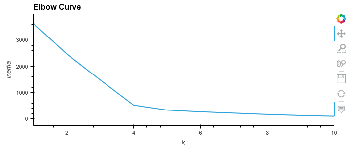
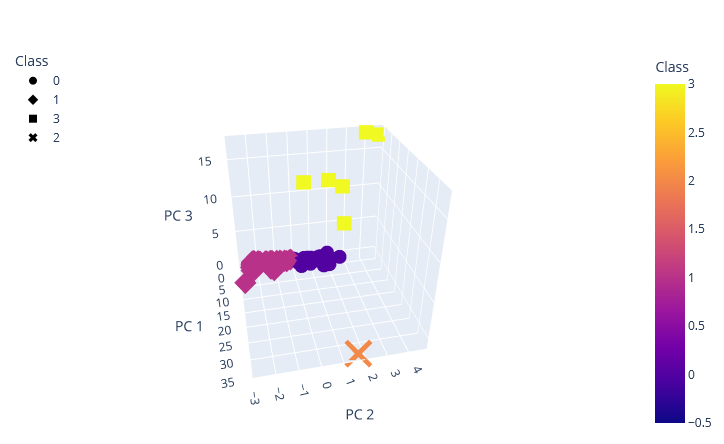
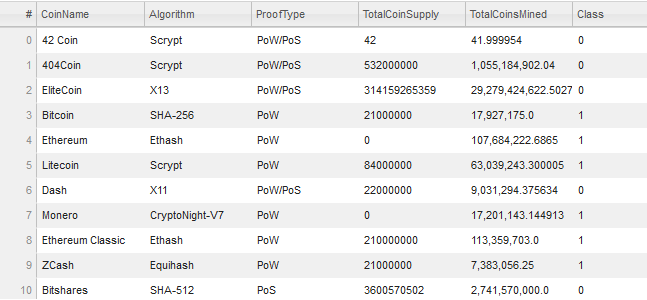
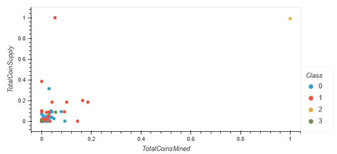

# Cryptocurrencies with PCA and KMeans Clustering

## Overview - Purpose

Accountability Accounting is an investment bank that is interested in offering a cryptocurrency investment portfolio for its customers. They would like us to create a report that includes what cryptocurrencies are on the trading market and how they can be grouped to create a classification system for this new investment. Therefore, we will need to cluster the cryptocurrencies to see what groupings are created. 

## Results

We started by preprocessing the data to get it ready to be handled by PCA. We then used PCA to create three principal components. Using KMeans clustering on the three principal components, 10 models were run from 1 to 10 clusters and an inertia value was saved. By plotting the elbow curve, as seen below, it was determined that 4 clusters were ideal for this data. A new KMeans cluster model was run with 4 clusters and predicted which class each cryptocurrency belonged in. All three principal component values were plotted in 3D, with the color indicating the class, and the name and algorithm in the hover data, as seen below. A table of the tradable cryptocurrencies was also made with hvplot table, as seen below. Finally, an hvplot scatter was used to plot TotalCoinsMined vs TotalCoinSupply, with the color indicating the class, and the hover data showing the coin name. 

